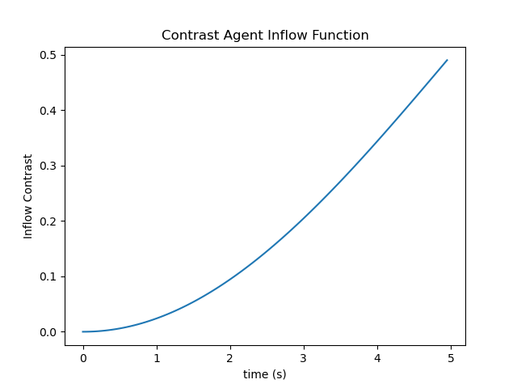
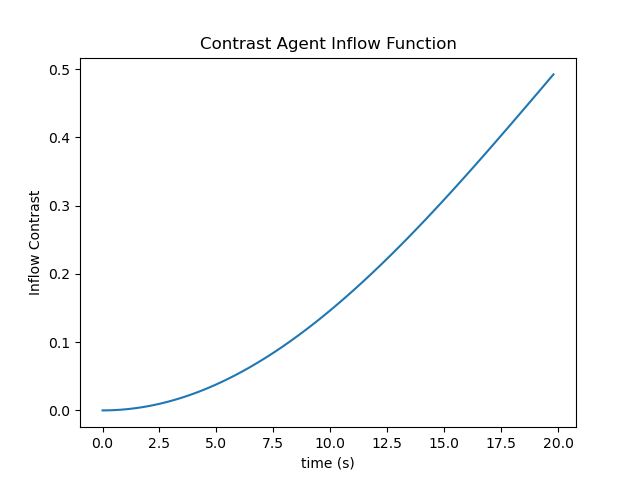
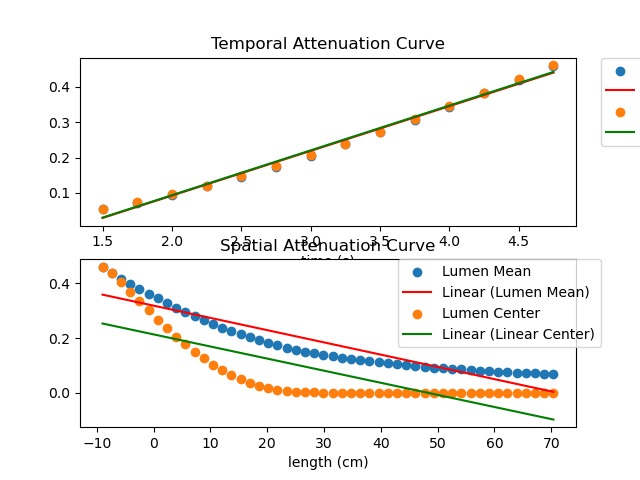
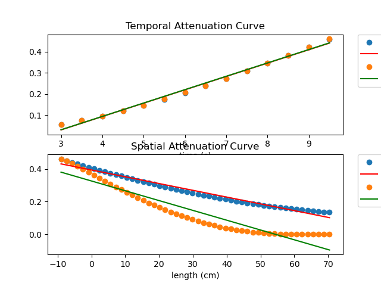
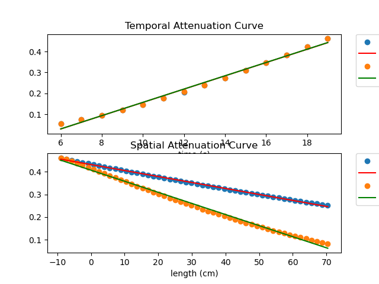
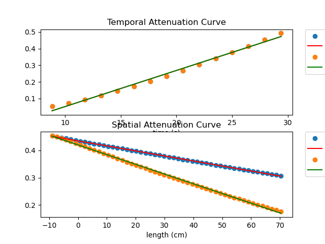
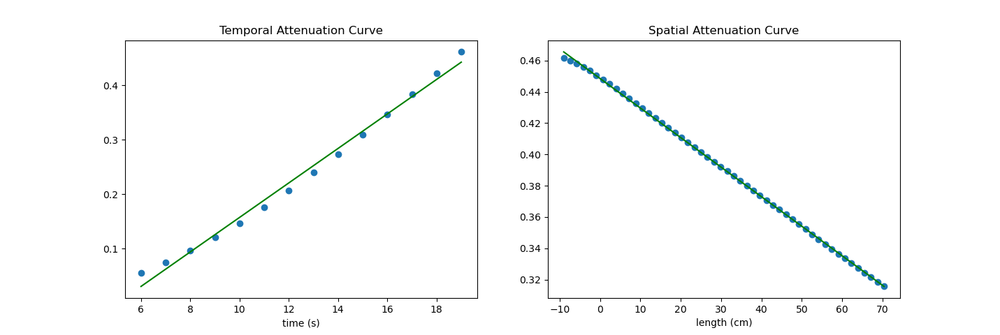

<h1 style="text-align:left; color:#cf50e6; font-family:times new roman;">Data and Results</h1>

In this section the results of our several tests on different phantoms are presented. The goal is to implement the contrast dispersion simulations on a pipe along which the contrast agent diffuses.

<h2 style="text-align:left; color: #cf50e6; font-family: times new roman;"> a) Straight Pipe Simulations</h2>

In this section we tried to implement the CFD and Advection Diffusion simulations on a straight pipe. The final goal is to calculate velocity using the Contrast Dispersion method presented by Eslami 2022. Our implementation contains of first generating the mesh of a straight pipe. The mesh is generated on SimVascular open source software. On SimVascular the Global Max Edge Size was assigned ${\color{lightblue} \scriptstyle 0.15 }$ and the final mesh was created with ${\color{lightblue} \scriptstyle 2,612,769}$ number of elements. Figure 1 presents the mesh of the straight pipe used in our simulations. This mesh is along the x-axis and witha length of 81 cm bounding from ${\color{lightblue} \scriptstyle x \in [-9, 72] cm}$. The diameter of the pipe is ${\color{lightblue} \scriptstyle d = 3 cm}$. In the next step, we assign a velocity to the CFD simulations which are run using Oasis solver on Niagara. In the next step we run the advection diffusion simulation using fenics and running on a hard drive at CIMBL. Finally, we use our implementation of the contrast disperssion method to acquire the mean velocity of the fluid. The followings are the tests that we have run on the straight pipe.

  

  fig. 1

<h3 style="text-align:left; color: #cf50e6">i) Test the run time</h3>

In this test, I changed the number of the cycles ran in the advection diffusion simulation from 5 cycles to 30 cycles. The duration of each cycle is 1 second and the number of time step in each cycle is 1000. The inflow boundary condition assigned to the pipe in each simulation changes with respect to the input number of the cycle using the following formula:

${\color{lightblue} \textstyle c_{min} + 0.5 \times (c_{max}-c_{min}) \times [1-cos(\pi \times \dfrac{t-T_s}{2 \times T_d})]}$

In which the $\color{lightblue} \scriptstyle c_{min} = 0.0$,${\color{lightblue} \scriptstyle c_{max} = 0.0}$, ${\color{lightblue} \scriptstyle T_{s} = 0.0}$, and ${\color{lightblue} \scriptstyle T_{d} = number\ of\ run\ cycles}$ which in our simulations varies from 5 to 20. The output function of this equation starts rising at 0 from 0 to 0.5 by the end of the last time cycle. The figure below shows how the assigned inflow function:

| | |
|--- |--- |
|
a
|
b
|

fig. 2. a) Inflow for 5 cycle b) Inflow for 20 cycle

Through doing several simulations with varying run-time from 5, 10, 20 to 30, in a pipe with a reynold's number of 500, I came to the results that the run-time of the Advection-Diffusion simulation should be selected with respect to the reynold's number assigned in the CFD simulations. The following figure shows the results for pipe with a reynold's number of 500 with 5, 10, 20, and 30 run-times in advection-diffusion simulation. The results contains the temporal and spatial attenuation curves using the values extracted along the centerline of the pipe from the centerline and the cross-sectional averages. Also, the velocity values were acquired using the centerline, and cross-sectional average values.

| | | | |
|--- |--- |--- |--- |
|
a
|
b
|
c
|
d
|

fig. 3. Temporal and spatial attenuation curve for Re500 with a) 5 run-time cycles  b) 10 run-time cycles c) 20 run-time cycles d) 30 run-time cycles Re; The spatial attenuation curve was obtained using the cross-sectional average and pipe center-line value.

As fig 3 suggests, with 5 and 10 run-time cycles, it is obvious that the contrast agent has not yet reached the end of the pipe, while 30 cycles the contrast agent has reached the end of the pipe long before. As for the first two, the model fit on the spatial attenuation curve is not accurate. Therefore, for the two latter one we can back calculate the velocity from advection-diffusion model. The assigned velocity to such a pipe with Re # of 500 is 6.66. For the run-time of 20 cycles the cross-sectional average velocity is $\color{lightblue} \scriptstyle 11.995 \frac{cm}{s}$ and the centerline velocity is $\color{lightblue} \scriptstyle 6.482 \frac{cm}{s}$, and for the run-time of 30 cycles the cross-sectional average velocity is $\color{lightblue} \scriptstyle 11.78 \frac{cm}{s}$ and the centerline velocity is $\color{lightblue} \scriptstyle 6.100 \frac{cm}{s}$. The results shows that the most accurate velocity is the one extracted from the centerline of the pipe with 20 cycles simulation run-time. While, for the 30 run-time cycles, the calculation errors of the linear implementation of the time derivative flows into the further time steps as we let the simulation continue further. The first equation below shows the linear approximation of the function derivative using the taylor series. The second equation shows as we loop over the derivative of the function, the error propagates to the next iteration:

$\color{lightblue} \textstyle \dfrac{dC}{dt} = \dfrac{\Delta C}{\Delta t} + E$

$\color{lightblue} \textstyle \dfrac{dC^i}{dt} = \dfrac{\Delta C^i}{\Delta t} + \sum E_i = \dfrac{C^i-C^{i-1}}{\Delta t} + \sum E_i$

As a result the velocity acquired from advection-diffusion simulation ran for 20 cycle, is the most accurate one. We need to consider that for the reynold's number of 500, the assigned velocity was about $\color{lightblue} \scriptstyle 6.66 \frac{cm}{s}$. Therefore, for the contrast bulos to reach the end of the pipe it takes $\color{lightblue} \scriptstyle \frac{81 cm}{6.66 \frac{cm}{s}} = 12.16 s $. Therefore, I tested running the advection-diffusion simulation for 13 time cycles.

<h3 style="text-align:left; color: #cf50e6; font-family: times new roman;"> ii) Test the centerline vs sectional average values </h3>

The results of the velocity from centerline vs sectional average values shows that the velocity is more accurate when we use the centerline extracted values. As a result, we implement the pipelines to use centerline values instead of the sectional average values as was presented in Eslami 2022 work.

<h3 style="text-align:left; color: #cf50e6; font-family: times new roman;"> iii) Test the Reynold's number</h3>

In a straight pipe, we ran the CFD simulation for a reynold's number of 500 and a reynold's number of 1500. The results of the $\color{lightblue} \scriptstyle Re = 500$ was presented above. The results for the $\color{lightblue} \scriptstyle Re = 1500$ can be found below. We ran the advection-diffusion simulations for 20 time cycles. The centerline velocity was $\color{lightblue} \scriptstyle 16.68 \frac{cm}{s}$ and the assigned velocity was $\color{lightblue} \scriptstyle 19.98 \frac{cm}{s}$. For 15 run-time cycle the centerline velocity was $\color{lightblue} \scriptstyle 20.11 \frac{cm}{s}$. The following figure shows the temporal and spatial attenuation curve for Re1500 with 20 run-time cycle:

fig. 4. 

<h2 style="text-align:left; color: #cf50e6; font-family: times new roman;"> b) Stenotic Pipe Simulation: Changing the Reynolds Number in the inlet of the geometry </h2>

Learning that we need to consider the centerline value of the contrast concentration in the straight pipe simulations, we move towards the stenotic pipe simulations. The stenotic pipe mesh is presented in the figure below. This pipe has the same length as the sraight pipe for $\color{lightblue} \scriptstyle x \in [-9,72]$ and the stenosis happens at $\color{lightblue} \scriptstyle x = 0$. I ran several simulation changing the Reynold's number from 100 to 1000. It is expected that 20 run-time cycle is not sufficient for all of the simulations with different Re #.

  

  fig. 5

<h3 style="text-align:left; color:#cf50e6; font-family: times new roman;"> i) assigning the run-time cycle for each simulation with a different Re # </h3>

As the length of the vessel is $\color{lightblue} \scriptstyle 81 cm$ and with the reynold's number of 500 the velocity is $\color{lightblue} \scriptstyle 6.66 \frac{cm}{s}$. Therefore, the time it takes that the bolus reaches the end of the vessel is $\color{lightblue} \scriptstyle \frac{81}{6.66} \approx 13 s$. The stenotic pipe simulatins at first ran for 20 time-cycles. The acquired results suggests that the 20 run-time cycle is not enough for the 
As a results the results for Re400 and Re500 with 20 run time cycles, the bolus reaches the end of the vessel, while, for Re300, Re200 and Re100 only 20 cycles are not enough. As a results, first we need to find the run-time cycle for each Re number:

|Re # |velocity |run-time cycles |
|--- |--- |---|
|
100 |
1.33 |
60.90 |
|
200 |
2.66 |
30.45 |
|
300 |
3.998|
20.26 |
|
400 |
5.33 |
15.19 |
|
500 |
6.66 |
12.16 |
|
600 |
7.997|
10.13 |
|
700 |
9.33 |
8.68 |
|
800 |
10.66|
7.59 |
|
900 |
11.99|
6.75 |
|
1000|
13.33|
6.07 |

However, the results from simulations with different time steps suggest that the proposed run-time above is not sufficient for the bolus to reach the end of the pipe.

